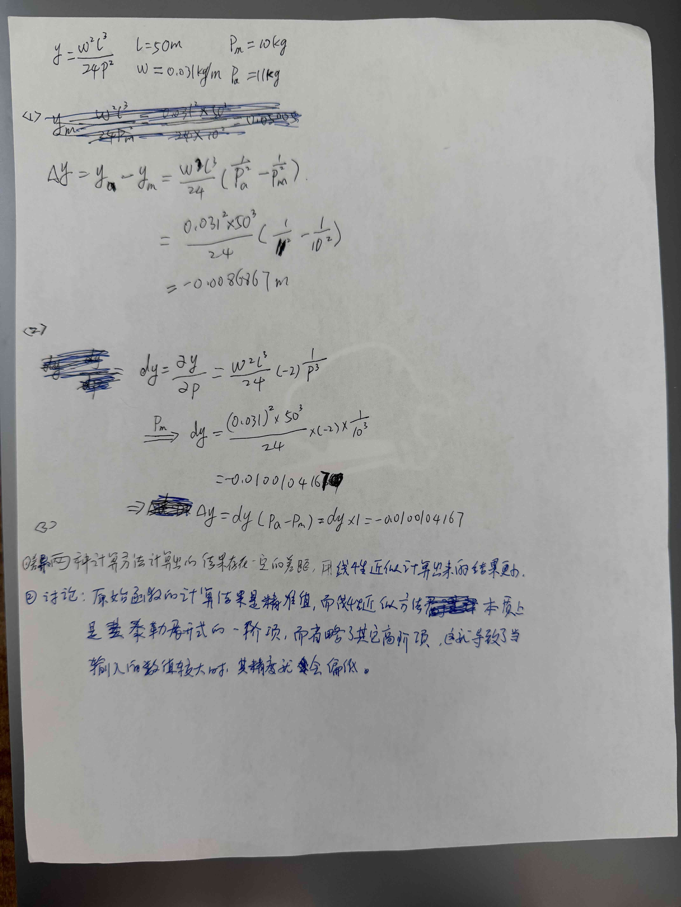
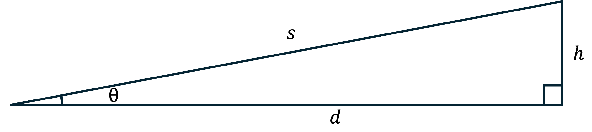
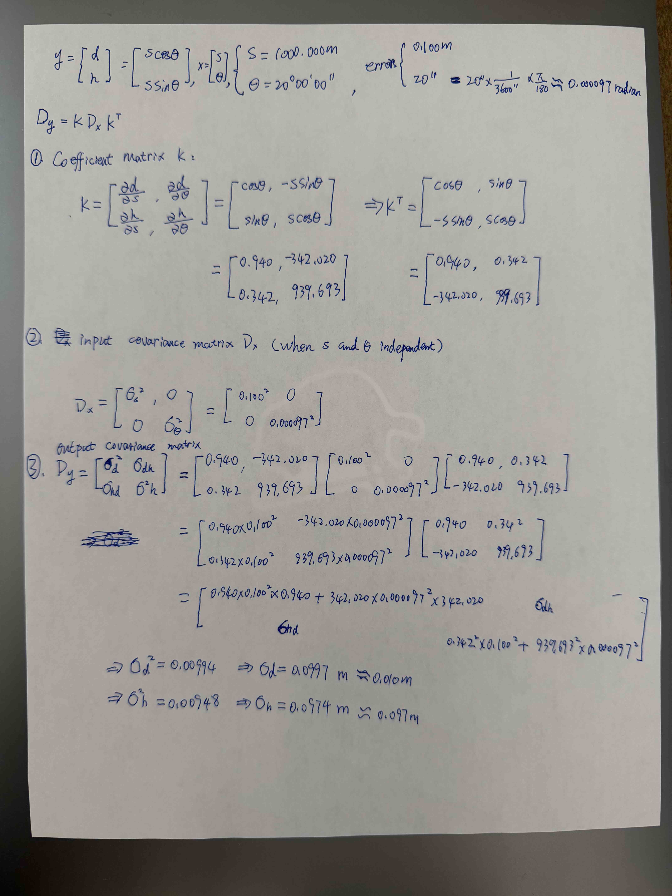

## Homework Assignment - Concept of Error Propagation


```python
import numpy as np
```

### 1. The correction for the sag of a tape is given by the function $y = \frac{w^2 l^3}{24p^2}$ in which $l$ is the length of the tape, $w$ is the unit weight of the tape, and $p$ is the applied pull. The length and unit weight of the tape are $50 m$ and $0.031 kg/m$, respectively, and the pull is variable. When you measured the applied pull in the field, it was $10 kg$, and the actual pull applied was $11 kg$. This is not possible in the real world in most cases, but we will just assume that this information is known in this problem.
   * Calculate the error of the sag using the original function
   * Calculate the error of the sag using the linear approximation
   * Compare the differences and discuss


```python
# Given parameters
print("Given parameters:")
l = 50  # m
print(f"l = {l}m")
omega = 0.031  # kg/m
print(f"ω = {omega}kg/m")
P_m = 10  # kg
print(f"P_m = {P_m}kg")
P_a = 11  # kg
print(f"P_a = {P_a}kg")

print("\n" + "="*50)

# Q1
print("\n(1)Calculate the error of the sag using the original function:")
print("Given function: \ny = (ω²l³)/(24P²)")

# Δy
print(f"\nΔy = y_a - y_m = (ω²l³/24) * (1/P_a² - 1/P_m²)")
print(f"   = (0.031² × 50³)/24 × (1/{P_a}² - 1/{P_m}²)")

# 
delta_y = (0.031**2 * 50**3 / 24) * (1/P_a**2 - 1/P_m**2)
print(f"   = {delta_y:.8f} m")

print("\n" + "="*50)

# Q2
print("\n(2)Calculate the error of the sag using the linear approximation:")
print("dy = ∂y/∂P = -(ω²l³/24) × (-2) × P⁻³")

print(f"\nP_m → dy = (0.031² × 50³)/24 × (-2) × {P_m}⁻³")

# dy
dy = (0.031**2 * 50**3 / 24) * (-2) * P_m**(-3)
print(f"      = {dy:.10f}")

print(f"\n⇒ So, Δy = dy(P_a - P_m) ≈ dy × 1 = {dy * 1:.10f}")

print("\n" + "="*50)

# Q3
print("\n(3)Compare the differences and discuss:")
print("1）Difference:\nThe two calculation methods yielded a noticeable difference in results. Specifically, the result obtained using linear approximation was smaller.")
print("2) Discussion: \nThe result from the original function is the exact value. However, the linear approximation method is essentially the first term of a Taylor expansion, and it ignores the higher-order terms. This is what causes the loss of accuracy when the input value is large.")

```

    Given parameters:
    l = 50m
    ω = 0.031kg/m
    P_m = 10kg
    P_a = 11kg
    
    ==================================================
    
    (1)Calculate the error of the sag using the original function:
    Given function: 
    y = (ω²l³)/(24P²)
    
    Δy = y_a - y_m = (ω²l³/24) * (1/P_a² - 1/P_m²)
       = (0.031² × 50³)/24 × (1/11² - 1/10²)
       = -0.00868673 m
    
    ==================================================
    
    (2)Calculate the error of the sag using the linear approximation:
    dy = ∂y/∂P = -(ω²l³/24) × (-2) × P⁻³
    
    P_m → dy = (0.031² × 50³)/24 × (-2) × 10⁻³
          = -0.0100104167
    
    ⇒ So, Δy = dy(P_a - P_m) ≈ dy × 1 = -0.0100104167
    
    ==================================================
    
    (3)Compare the differences and discuss:
    1）Difference:
    The two calculation methods yielded a noticeable difference in results. Specifically, the result obtained using linear approximation was smaller.
    2) Discussion: 
    The result from the original function is the exact value. However, the linear approximation method is essentially the first term of a Taylor expansion, and it ignores the higher-order terms. This is what causes the loss of accuracy when the input value is large.


### Handwritten draft


### 2. Linearize the function $y = [(100)^2 + x^2 - 200x cos \alpha]^{1/2}$ at $x_0 = 80.000 m$ and $\alpha_0 = 40°00'$ using a Taylor Series Expansion. Use the linearized function to evaluate $y$ at $x = 81.000 m$ and $\alpha = 40°20'$, and compare and discuss the resulting value with the value of $y$ obtained using the original function. 


```python
print("Given function: \n\ny = [(100)² + x² - 200x cos α]^(1/2)")

print("\nGiven parameters:\n")
x_0 = 80.000  # m
alpha_0 = 40 * np.pi / 180  # 40°00' = 0.698 radian
print(f"x_0 = {x_0:.3f} m,  α_0 = 40°00'  α_0 = 40° × π/180 = {alpha_0:.3f} radian")

x = 81.000  # m
alpha = 40 + 20/60  # 40°20'
alpha = alpha * np.pi / 180
print(f"x = {x_1:.3f} m,  α = 40°20'  α = {alpha:.1f}° × π/180 = {alpha:.3f} radian")

print(" ")
print("\n" + "="*50)
print("\n1) Linearize the function:")

# dy
print("\ndy = y(x_0, α_0) + ∂y/∂x dx + ∂y/∂α dα")
print("\n   = y(x_0, α_0) + ∂y/∂x (x - x_0) + ∂y/∂α (α - α_0)")

# y(x_0, α_0)
y_x0_a0 = ((100**2 + x_0**2 - 200 * x_0 * np.cos(alpha_0))**0.5)
print(f"\n① y(x_0, α_0) = [(100² + 80² - 200×80×cos0.698)]^(1/2) = {y_x0_a0:.3f}")

# ∂y/∂x
term1 = (100**2 + x_0**2 - 200 * x_0 * np.cos(alpha_0))**(-0.5)
term2 = (2 * x_0 - 200 * np.cos(alpha_0))
dy_dx = 0.5 * term1 * term2 * (x_1 - x_0)
print(f"\n② ∂y/∂x (x-x_0) = 0.5 × (100² + x² - 200xcosα)^(-1/2) × (2x_0 - 200cosα_0) × (x-x_0)")
print(f"             = 0.5 × (100² + 80² - 200×80×cos0.698)^(-1/2) × (2×80 - 200cos0.698) × (81-80)")
print(f"             = {dy_dx:.3f}")

# ∂y/∂α
term3 = 0.5 * (100**2 + x_0**2 - 200 * x_0 * np.cos(alpha_0))**(-0.5)
term4 = (-200 * x_0 * (-np.sin(alpha_0)))
term5 = (alpha - alpha_0)
dy_da = term3 * term4 * term5
print(f"\n③ ∂y/∂α (α-α_0) = 0.5 × (100² + x_0² - 200x_0cosα_0)^(-1/2) × (-200x × (-sinα_0)) × (α-α_0)")
print(f"             = 0.5 × (100² + 80² - 200×80×cos0.698)^(-1/2) × (200×80×sin0.698) × (0.704 - 0.698)")
print(f"             = {dy_da:.3f}")

# Linearization results
dy_linear = y_x0_a0 + dy_dx + dy_da
print(f"\n⇒ dy = {y_x0_a0:.3f} + {dy_dx:.3f} + {dy_da:.3f} = {dy_linear:.3f} m")

print(" ")
print("\n" + "="*50)
print("\n2) Original function:")
y_original = ((100**2 + x_1**2 - 200 * x_1 * np.cos(alpha_v1))**0.5)
print(f"y = [(100² + x² - 200xcosα)]^(1/2) = [(100² + 81² - 200×81×cos0.704)]² = {y_original:.3f}")

print(" ")
print("\n" + "="*50)
print("\n3) Compare: \n y_original function(y) ≈ y_Linearized function (dy)")
print(" but           y              >             dy")

diff = y_original - dy_linear
print(f"y - dy = {diff:.3f}")

print(" ")
print("\n" + "="*50)
print(f"\n4)discuss: \n① Linear approximation only uses the first order term of the Taylor series expansion, ignore the higher order terms. The difference between the two results is caused by these ignore higher order terms.")
print(f"② The accuracy of linear approximation is relatively high, as long as the change in the observed values is small")
```

    Given function: 
    
    y = [(100)² + x² - 200x cos α]^(1/2)
    
    Given parameters:
    
    x_0 = 80.000 m,  α_0 = 40°00'  α_0 = 40° × π/180 = 0.698 radian
    x = 81.000 m,  α = 40°20'  α = 0.7° × π/180 = 0.704 radian
     
    
    ==================================================
    
    1) Linearize the function:
    
    dy = y(x_0, α_0) + ∂y/∂x dx + ∂y/∂α dα
    
       = y(x_0, α_0) + ∂y/∂x (x - x_0) + ∂y/∂α (α - α_0)
    
    ① y(x_0, α_0) = [(100² + 80² - 200×80×cos0.698)]^(1/2) = 64.368
    
    ② ∂y/∂x (x-x_0) = 0.5 × (100² + x² - 200xcosα)^(-1/2) × (2x_0 - 200cosα_0) × (x-x_0)
                 = 0.5 × (100² + 80² - 200×80×cos0.698)^(-1/2) × (2×80 - 200cos0.698) × (81-80)
                 = 0.053
    
    ③ ∂y/∂α (α-α_0) = 0.5 × (100² + x_0² - 200x_0cosα_0)^(-1/2) × (-200x × (-sinα_0)) × (α-α_0)
                 = 0.5 × (100² + 80² - 200×80×cos0.698)^(-1/2) × (200×80×sin0.698) × (0.704 - 0.698)
                 = 0.465
    
    ⇒ dy = 64.368 + 0.053 + 0.465 = 64.886 m
     
    
    ==================================================
    
    2) Original function:
    y = [(100² + x² - 200xcosα)]^(1/2) = [(100² + 81² - 200×81×cos0.704)]² = 64.899
     
    
    ==================================================
    
    3) Compare: 
     y_original function(y) ≈ y_Linearized function (dy)
     but           y              >             dy
    y - dy = 0.013
     
    
    ==================================================
    
    4)discuss: 
    ① Linear approximation only uses the first order term of the Taylor series expansion, ignore the higher order terms. The difference between the two results is caused by these ignore higher order terms.
    ② The accuracy of linear approximation is relatively high, as long as the change in the observed values is small


### Handwritten draft


### 3. With reference to the figure below, a vector $y = [d, h]^T$ is a nonlinear function of a vector $x = [s, \theta]^T$. If measured values for $s$ and $\theta$ are $1000.000m$ and $20°00'00''$, respectively, and their errors are $0.100m$ and $20''$, respectively, evaluate the errors in the computed values of $d$ and $h$ by applying error propagation to the linearized form of $y$.





```python
print("Given parameters:\n")
print("y = [d] = [Scosθ] ")
print("    [h]   [Ssinθ]  ")
print("x = [s] ")
print("    [θ] ")
S = 1000.000  # m
print("\nS = 1000.000m")
theta = 20 * np.pi / 180 
print("θ = 20°00'00''")
sigma_s = 0.100  # m
sigma_theta = 0.000097  # radian
print(f"\nerror: \n0.100m, \n20'' = 20'' × 1/3600'' × π/180 ≈ 0.000097 radian")

print(" ")
print("\n" + "="*50)
print("\nKonwn function:\n Dy = k Dx k^T")

print(" ")
print("\n" + "="*50)
print("\n(1) Coefficient matrix k:")

# Coefficient matrix k
print(f"\nk = [∂d/∂s, ∂d/∂θ] = [cosθ, -Ssinθ]")
print(f"    [∂h/∂s, ∂h/∂θ]   [sinθ, Scosθ]")

k = np.array([
    [np.cos(theta), -s * np.sin(theta)],
    [np.sin(theta), s * np.cos(theta)]
])

print(f"\n  = [{k[0,0]:.3f}, {k[0,1]:.3f}]")
print(f"    [{k[1,0]:.3f}, {k[1,1]:.3f}]")

# k^T
print(f"\n⇒ k^T = [{k11:.3f}, {k21:.3f}]")
print(f"        [{k12:.3f}, {k22:.3f}]")

# print(" ")
# print("\n" + "="*50)
print("\n(2) input covariance matrix Dx (when s and θ independent):")

# input covariance matrix Dx
Dx = np.array([
    [sigma_s**2, 0],
    [0, sigma_theta**2]
])

# print(f"\nDx = [σs², 0  ] = [{sigma_s**2:.3f}, 0        ]")
# print(f"     [0,  σθ²]   [0,        {sigma_theta**2:.10f}]")

print(f"\nDx = [σs², 0] = [{Dx[0,0]:.3f}, {Dx[0,1]}           ]")
print(f"     [0,  σθ²]  [{Dx[1,0]},   {Dx[1,1]:.12f}]")

# print(" ")
# print("\n" + "="*50)
print("\n(3) output covariance matrix:\n")

Dy = k @ Dx @ k.T
print("Dy = [σd²,  σdh ] = k × Dx × k^T")
print("     [σhd,  σh² ]")
# print(f"\nDy = k × Dx × k^T")
print(f"\n   = [{k[0,0]:.3f}, {k[0,1]:.3f}] [{Dx[0,0]:.3f}, {Dx[0,1]}           ] [{k[0,0]:.3f}, {k[1,0]:.3f}]")
print(f"     [{k[1,0]:.3f}, {k[1,1]:.3f}] [{Dx[1,0]},    {Dx[1,1]:.12f}] [{k[0,1]:.3f}, {k[1,1]:.3f}]")

# k × Dx
k_Dx = k @ Dx
print(f"\n   = [{k_Dx[0,0]:.6f}, {k_Dx[0,1]:.18f}] [{k[0,0]:.3f}, {k[1,0]:.3f}]")
print(f"     [{k_Dx[1,0]:.6f}, {k_Dx[1,1]:.15f}] [{k[0,1]:.3f}, {k[1,1]:.3f}]")

# result
print(f"\n   = [{Dy[0,0]:.6f}, σdh ]")
print(f"     [σhd, {Dy[1,1]:.6f}]")

print(" ")
print("\n" + "="*50)

# Calculation errors
sigma_d = np.sqrt(Dy[0,0])
sigma_h = np.sqrt(Dy[1,1])

print(f"\n⇒ σd² = {Dy[0,0]:.5f}  ⇒ σd = {sigma_d:.4f} m ≈ 0.010m")
print(f"⇒ σh² = {Dy[1,1]:.5f}  ⇒ σh = {sigma_h:.4f} m ≈ 0.097m")
```

    Given parameters:
    
    y = [d] = [Scosθ] 
        [h]   [Ssinθ]  
    x = [s] 
        [θ] 
    
    S = 1000.000m
    θ = 20°00'00''
    
    error: 
    0.100m, 
    20'' = 20'' × 1/3600'' × π/180 ≈ 0.000097 radian
     
    
    ==================================================
    
    Konwn function:
     Dy = k Dx k^T
     
    
    ==================================================
    
    (1) Coefficient matrix k:
    
    k = [∂d/∂s, ∂d/∂θ] = [cosθ, -Ssinθ]
        [∂h/∂s, ∂h/∂θ]   [sinθ, Scosθ]
    
      = [0.940, -342.020]
        [0.342, 939.693]
    
    ⇒ k^T = [0.940, 0.342]
            [-342.020, 939.693]
    
    (2) input covariance matrix Dx (when s and θ independent):
    
    Dx = [σs², 0] = [0.010, 0.0           ]
         [0,  σθ²]  [0.0,   0.000000009409]
    
    (3) output covariance matrix:
    
    Dy = [σd²,  σdh ] = k × Dx × k^T
         [σhd,  σh² ]
    
       = [0.940, -342.020] [0.010, 0.0           ] [0.940, 0.342]
         [0.342, 939.693] [0.0,    0.000000009409] [-342.020, 939.693]
    
       = [0.009397, -0.000003218067528551] [0.940, 0.342]
         [0.003420, 0.000008841567869] [-342.020, 939.693]
    
       = [0.009931, σdh ]
         [σhd, 0.009478]
     
    
    ==================================================
    
    ⇒ σd² = 0.00993  ⇒ σd = 0.0997 m ≈ 0.010m
    ⇒ σh² = 0.00948  ⇒ σh = 0.0974 m ≈ 0.097m


### Handwritten draft


## Thank you for your time
